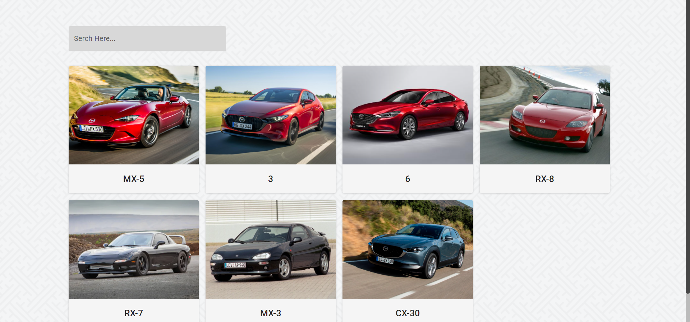
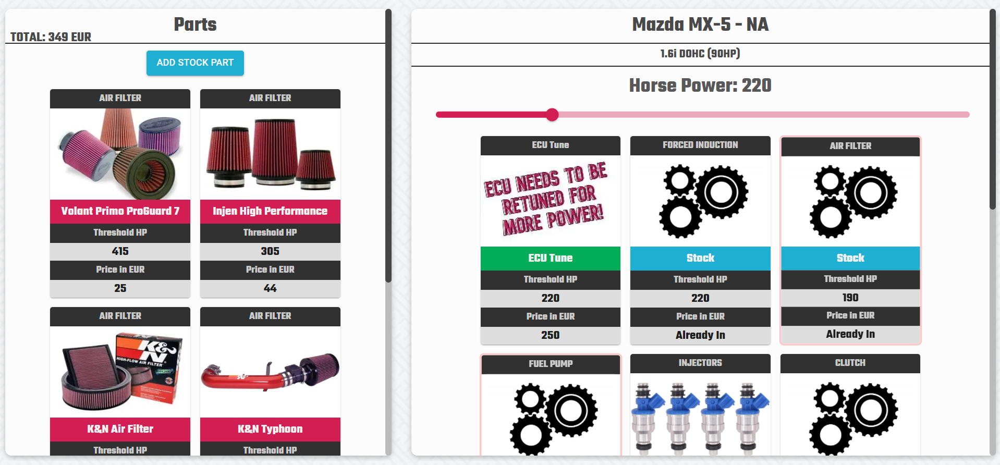

# MOTORONIQ

Motorinq is a website application aimed at helping car enthusiasts with planning their next project build. It lets user selects their car make, model, generation and engine. User will then see dashboard where is able to select horse power for his build. Based on these parameters, website will show user what parts needs to be upgraded and the options for the upgrade. It will also calculate the total cost of all parts (ECU tune included).

## What motoroniq solves:

1. Saves time as user doesn't need to go through forums and articles.
2. User can instantly see the most important information (price, power threshold, compatibility)

## Screenshots

<br />

### Index Page

<br />

<p align="center">
  
</p>

<br />

### List Page

<br />

<p align="center">
  
</p>

<br />

### Dashboard Page

<br />

<p align="center">
  
</p>

<br />

# Getting started

This project uses MySQL, if you don't have it, you will need to install it.

https://dev.mysql.com/downloads/

## Installation

### 1. Clone this repo and enter!

```bash
git clone https://github.com/Vitto44/Motoroniq.git
cd Motoroniq
```

<br />

### 2. Install dependencies.

```bash
cd server
npm i   # to install dependencies for server
cd ..
cd client
npm i   # to install dependencies for client
```

<br />

### 3. In the server, you will need to create .env file and add PORT

```bash
PORT = port you want your server to run on, otherwise port will be 4444
```

<br />

### 4. From the server file run:

<br/>

Go to config/config.json and make sure that username and password match your local database.

<br/>

### 5. From the server file run:

```bash
node index.js
```

You should see the following message:

🤖 You good Boss! (☞ ﾟヮﾟ)☞ http://localhost:portnumber ☜(ﾟヮﾟ ☜)

<br />

### 6. Run the following command in order to populate database (database needs to be running)

```bash
npx sequelize-cli db:seed:all
```

<br />

### 7. Run both server and client (you will need two terminals open)

From server run:

```bash
node index.js   # I would suggest installing nodemon globally and do nodemon instead of node
```

From client run:

```bash
npm run dev
```

<br />

## Good to go! Visit http://localhost:3000 and you should be able to see the index page

<br />

# Tech Stack

## Back-end

- [Express](https://github.com/expressjs/express)
- [Sequelize](https://sequelize.org/)
- [MySQL](https://dev.mysql.com/doc/) (Database)

## Front-end

- [ReactJS](https://reactjs.org/docs/getting-started.html)
- [NextJS](https://nextjs.org/docs/getting-started)
- [Material-UI](https://mui.com/getting-started/usage/)

# Developers

- Viktor Hajdu - [GitHub](https://github.com/Vitto44) - [LinkedIn](https://www.linkedin.com/in/viktor-hajdu/)
